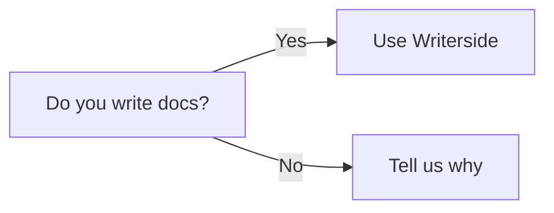

<no-index instance="hi"/>
<web-file-name>newGG.html</web-file-name>
<show-structure for="chapter,procedure" depth="3"/>
<card-summary>This information is displayed in the card on the starting page.</card-summary>
<link-summary>This information is displayed in the link popup</link-summary>
<link-summary rel="my-paragraph"/>

# newG

## header1

## include reusable content

<include from="warning_library.md" element-id="generic_warning">
  <var name="version" value="1.2.1"/>
</include>

## reuse a single topic

## Math

This article aims to guide users on how to incorporate math equations using Tex syntax in Writerside. For more information on syntax, see [LaTeX/Mathematics](https://en.wikibooks.org/wiki/LaTeX/Mathematics) in Wikibooks.

```tex
\begin{equation}
x = \frac{-b \pm \sqrt{b^2 - 4ac}}{2a}
\end{equation}
```

## mermaid


[mermaid website](https://mermaid.js.org/)

## summary elements

<p id="my-paragraph">
    This is the text to use as a link summary.
</p>

## codeblock {switcher-key="codeblock"}
<code-block lang="xml">
    <![CDATA[
    ``` xml
    <some-tag>
    text in tag
    </some-tag>
    ```
    ]]>
</code-block>

```xml
<some-tag>
text in tag
</some-tag>
```

## tabs {switcher-key="tabs"}

<tabs>
  <tab title="one">
    one content
  </tab>
  <tab title="two">
    two content
  </tab>
</tabs>

## Definition lists

{style="narrow" sorted="desc"}
First Term
: This is the definition of the first term.

Second Term
: This is the definition of the second term.

## list

1. First item.
   1. First indented item.
   2. Second indented item.

   {style="alpha-lower"}
2. Second item.
3. Third item
4. Fourth item

{start="2"}

- Some list item
- Another list item
- Yet another list item
  - Some indented item
  - Another indented item
- One more item

## image

  

{ thumbnail="true" }

## Markdown links

press <shortcut key="$Insert"/> to open the Insert menu
[a link to shortcut](#shortcut)

[Link text](two.md "A summary to display when hovering over the link")

You can reference [the JetBrains website][jb] multiple times
and even use [different link text][jb] every time.
Or reference an [anchor][anc].

[jb]: https://www.jetbrains.com
[anc]: #shortcut

## Tip

<tip>
  <p>
    A piece of advice
  </p>
</tip>

> A piece
> of advice

## Note

<note>
  <p>a note</p>
</note>

> a note
> {style="note"}

## tldr

<tldr>
    <p>
        Shortcut: <shortcut>Ctrl+Space</shortcut>
    </p>
    <p>
        Configure: <ui-path>Settings / Preferences | Editor | Code Completion</ui-path>
    </p>
</tldr>

## format

<format style="bold" color="RosyBrown">Hello, world!</format>
<format style="subscript" color="Red">Hello, world!</format>

## shortcut

<shortcut>Ctrl+C</shortcut> 

<shortcut key="$Copy"/>


## markup

*star content*

<p>
    A Writerside
    <emphasis>project</emphasis>
    consists of a set of documentation topics
    and configuration files that define the
    project and preview settings, glossaries,
    and the documentation structure.
</p>

### control

```html
<control>control content</control>
```
<control>control content</control>

### emphasis


[to tomcat one](one.md)
## Hey {collapsible=true id="hesl"}
<compare first-title="B">
  <code-block src="a.js"></code-block>
  <code-block>
    public static void main(String[] args) {
      System.out.println("Hi!")
    }
  </code-block> 
</compare>

Send an <tooltip term="GUI">GUI</tooltip> to you

<procedure title="Add something" id="procedure-id" type="choices" collapsible="false">
   <p>Before adding <code>something</code>, create it.</p>
   <step>Do this.</step>
   <step><control>Do that.</control></step>
   <p>Congratulation! You've added something.</p>
</procedure>
